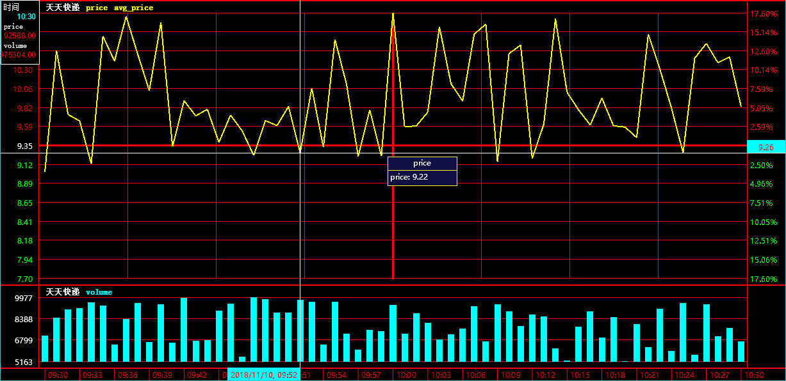

title: 快速上手-一个例子
---

## 简介
图表内容的生成包含以下几个步骤：

1. 全局设置图表的显示风格（可选步骤）
2. 添加面板
3. 向面板中添加序列
4. 设置图表显示的风格（启用/禁用功能）
5. 向图表灌入数据

比如，要显示如下的图表: 
```cpp
    static const SkString PRICE_LINE = "price";

    // 添加面板
    main_panel_ = addPanel();

    // 添加序列
    addSeries(main_panel_, PRICE_LINE, charty::SeriesType::kLine, PRICE_LINE);

    // 设置序列的风格
    setSeriesStyle(main_panel_, styles);

    // 设置显示的精度
    setPrecision(main_panel_, 2, 10000);

    // 是否显示网格线
    showGrid(main_panel_, true, true);
    setValueSlice(14);

    // 垂直网格线
    setGridVerticalSlice(main_panel_, 8);

    // 按需添加其他的面板，进行设置等
    ...

    // 灌入数据
    addValue(MarketChart::PRICE_LINE, d_price);
```

